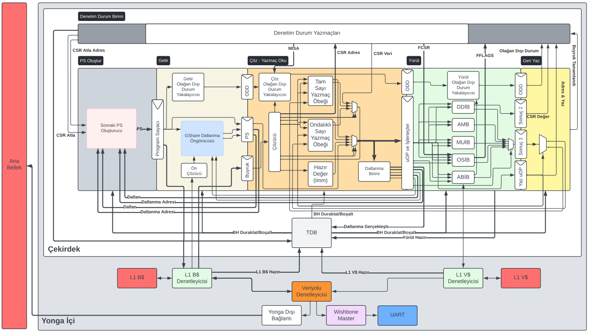

# Teknofest Çip Tasarım 2024 - Kasırga Toprak İşlemcisi

İşlemci boru hattı 5 aşamadan oluşmaktadır.

# Kasırga Toprak


# Synopsys Çip Serim Çıktısı


## Takım Üyeleri
```
İsmail Emir Yüksel - Danışman
Umut Başer         - Takım Kaptanı
Vatan Zengin       - Lisans Üye
Şeref Taha Kılıç   - Lisans Üye
```

## Çip Özeti
```
- RV32IMAFB_Zicsr Buyruk Kümesi Desteği
- 5 Aşamalı Sıralı Boru Hattı
- 4 KiB Veri ve Buyruk Önbelleği
- Wishbone Çevresel Veriyolu
- UART Çevre Birimi Cihazı Desteği
- 2.01 CoreMark/MHz (VCU108)
- VCU108 FPGA Frekansı  : 75 MHz
- BASYS3 FPGA Frekansı  : 35 MHz
- Synopsys Çip Frekansı : 100 MHz
```

## Git Dosya Yapısı

```
gorseller/                  GitHub sunum görselleri
misc/                       FPGA constraintleri ve bellek doldurma test kodları
rtl/                        KASIRGA-TOPRAK işlemcisi kaynak kodları
 |_ bellek/                 Önbellek denetleyicileri ve önbellek model kaynak kodları
 |_ cekirdek/               Çekirdek kaynak kodları
   |_ pkgs                  İlgili SystemVerilog modüllerinin fonksiyonlarını ve veri yapılarını içerir
   |_ yurut                 Yürüt boru hattı aşaması alt birimlerinin kaynak kodları
     |_ cvfpu               CVFPU FPU modülü kaynak kodu
     |_ toplayici           Kogge-Stone toplayıcı kaynak kodu
 |_ inc/                    Parametre tanımlama dosyaları
 |_ ip/                     Clock Wizard Vivado IP dosyaları (Vivado 2023.2)
 |_ teknofest/              Teknofest Wrapper kaynak kodları
 |_ uart/                   UART Çevre Birimi kaynak kodları
 |_ veriyolu/               Veriyolu ve Wishbone Master kaynak kodları
 |_ cekirdek.sv             Çekirdek üst modül kaynak kodu
 |_ yonga.sv                Yonga üst modül kaynak kodu
tests/                      Demo programları ve benchmarklar
 |_ coremark/               CoreMark benchmark kaynak kodu
 |_ dhrystone/              Dhrystone benchmark kaynak kodu            
 |_ kasirga/                Kasırga UART demosu kaynak kodu              
 |_ rx_test/                UART RX test kaynak kodu
 |_ uart_cikti/             UART çıktı testi kaynak kodu
 |_ whetstone/              Whetstone benchmark kaynak kodu
 |_ yardimci                Demo testleri için yardımcı araçlar
```

## Hazır Kullanılan Modüller

```
CVFPU FPU Modülü      : https://github.com/openhwgroup/cvfpu
Kogge Stone Toplayıcı : https://github.com/jeremytregunna/ksa
```

# Synopsys Çıktıları
https://1drv.ms/f/c/76140e6c5a65dbc1/EpH3Y8iD4xlMvKQIbeuy-2cBKc9XehIzq5hRykHoJbRRfQ?e=jEE95W


```
This repository was forked from https://github.com/baseru/KASIRGA-TOPRAK.
```