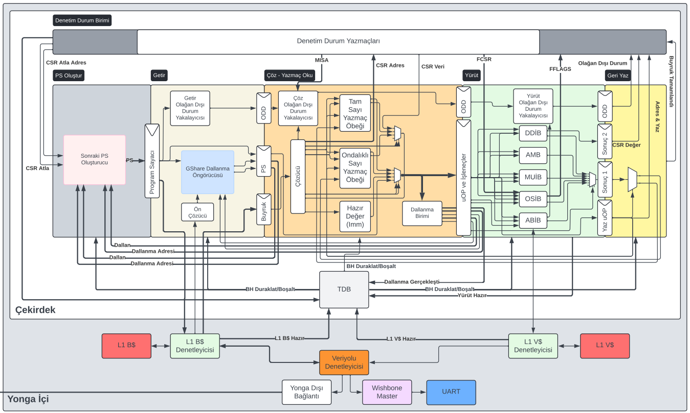

# KASIRGA-TOPRAK RISC-V Processor | Teknofest 2024 Digital Chip Design Competition 🏆 3rd

## 📌 Chip Overview

- **Instruction Set:** RV32IMAFB_Zicsr  
- **Pipeline:** 5-stage in-order  
- **Cache:** 4 KiB instruction + data cache  
- **Bus Interface:** Wishbone peripheral bus  
- **Peripheral Support:** UART module  
- **Performance:** 2.01 CoreMark/MHz on VCU108  
- **FPGA Frequencies:**  
  - VCU108: 75 MHz  
  - BASYS3: 35 MHz  
- **ASIC Synthesis:** 100 MHz (Synopsys 32nm)

---

## 📁 Git Directory Structure

```bash
gorseller/                  # GitHub presentation visuals  
misc/                       # FPGA constraints and memory test scripts  
rtl/                        # RTL source files for KASIRGA-TOPRAK core  
  ├── bellek/               # Cache controller and memory model code  
  ├── cekirdek/             # Core architecture modules  
  │   ├── pkgs/             # Functions and data structures (SystemVerilog packages)  
  │   └── yurut/            # Execution stage submodules  
  │       ├── cvfpu/        # CVFPU floating point unit  
  │       └── toplayici/    # Kogge-Stone adder module  
  ├── inc/                  # Parameter definitions  
  ├── ip/                   # Clock Wizard IP (Vivado 2023.2)  
  ├── teknofest/            # Teknofest wrapper modules  
  ├── uart/                 # UART peripheral implementation  
  ├── veriyolu/             # Wishbone bus and master controller  
  ├── cekirdek.sv           # Core top-level module  
  └── yonga.sv              # Chip top-level module  
tests/                      # Demo applications and benchmarks  
  ├── coremark/             # CoreMark benchmark test  
  ├── dhrystone/            # Dhrystone benchmark test  
  ├── kasirga/              # UART-based demo app  
  ├── rx_test/              # UART RX testing  
  ├── uart_cikti/           # UART output tests  
  ├── whetstone/            # Whetstone benchmark test  
  └── yardimci/             # Helper scripts for test benches  


# 🧬 Synopsys Chip Layout Output


---

## ⛓️ Processor Pipeline Diagram



---

## 📂 Synopsys Reports & Analysis Files
🔗 [Open Synopsys Output Folder](https://1drv.ms/f/c/76140e6c5a65dbc1/EpH3Y8iD4xlMvKQIbeuy-2cBKc9XehIzq5hRykHoJbRRfQ?e=jEE95W)


